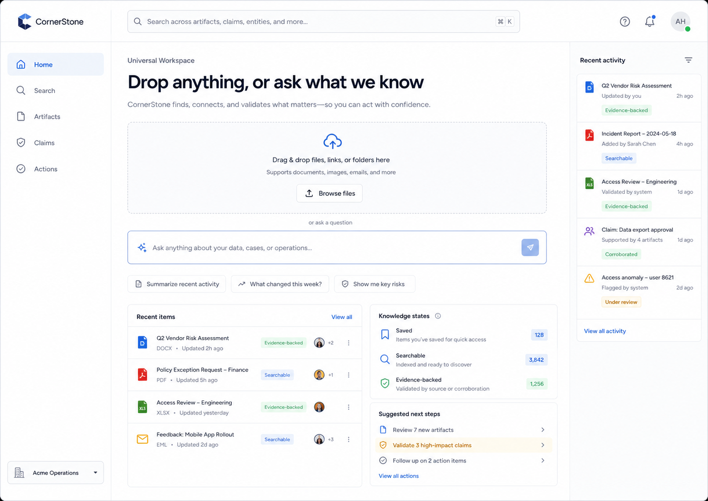
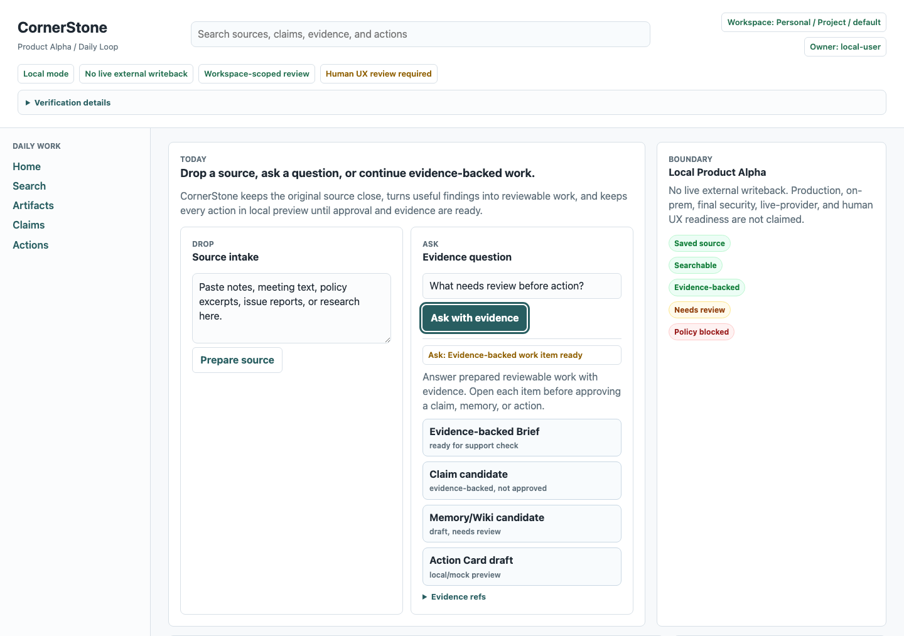

# VS4-H01 UI/UX Rejection Report

**Date:** 2026-07-04 KST
**Owner:** JiYong / Tars
**Audience:** Product / Engineering leadership
**Status:** Human owner review recorded as `REJECT`
**Decision impact:** VS5 external-user sessions must not begin from the current VS4 Product Alpha UI.

## Executive Summary

VS4-H01 was rejected by the owner because the implemented Product Alpha UI does not follow the attached CornerStone UI/UX reference direction. The issue is not limited to Drop / Ask discoverability. It is a broader mismatch in visual hierarchy, information architecture, first-value workflow, and user-facing product feel.

The current implementation has strong structural evidence: local scenario rows, CLI paths, browser/DOM proof, and human-gate package generation exist. However, that structural readiness did not translate into an acceptable human-facing product surface. The implemented UI exposes internal workflow and verification complexity before it gives a normal user the calm workspace promised by the reference images and design system.

Leadership-level decision needed: pause VS5 external-user testing, treat the current VS4 UI as rejected for human UX acceptance, and open a focused VS4-H01 UI recovery effort before retrying the gate.

## Current Verdict

| Gate | Required decision | Current decision | Result |
| --- | --- | --- | --- |
| `VS4-H01` | JiYong / Tars accepts, accepts with exceptions, or rejects the VS4 Product Alpha UI flow | `REJECT` | Entry gate for VS5 external-user testing is blocked |

The reviewer record states:

> REJECT. The current VS4 Product Alpha UI is not acceptable for external-user VS5 entry because it does not follow the attached UI/UX reference direction. This is a full visual hierarchy, information architecture, and human-friendly workflow mismatch, not only a Drop / Ask discoverability issue.

Source: `reports/human-gates/vs4/filled-records/VS4-H01.review-record.json`

## Evidence Base

| Evidence | Path | What it proves |
| --- | --- | --- |
| Owner rejection record | `reports/human-gates/vs4/filled-records/VS4-H01.review-record.json` | Dated human decision: `REJECT`, with issue list and usability findings |
| Rejection validation output | `reports/human-gates/vs4/validation-results/VS4-H01.validation.json` | Record is structurally valid; no sensitive-marker or overclaim findings |
| Reference image index | `docs/design/reference-images/README.md` | Reference images are active design inputs for CornerStone UI direction |
| Home reference image | `docs/design/reference-images/cornerstone-reference-07-home-upload-ask.png` | Target direction for Home workspace: drop zone, ask box, recent items, knowledge states, suggested next steps, recent activity |
| Current VS4 browser screenshot | `reports/browser/vs4-product-alpha-ui-daily-loop-slice-001/home.png` | Current implemented UI visual proof |
| Design system contract | `docs/design/DESIGN_SYSTEM_CONTRACT_V0_3.md` | Non-negotiable visual doctrine: calm workspace, small navigation, progressive evidence |
| Design concept | `docs/design/DESIGN_CONCEPT_SYSTEM_V0_3.md` | Approved direction: light workspace centered on drop, search, ask, recent work, and quiet evidence state |
| Current Home implementation source | `packages/cornerstone_cli/product_runtime.py` | Shows dense Product Alpha Home construction with many product-panel sections and review/package details |

## Reference Direction

The active design reference set is stored under `docs/design/reference-images/`. The index states that the images preserve the current visual direction and should guide future UI implementation.

For the Home workspace, the reference target is:



The reference Home includes:

- fixed, calm left navigation;
- prominent global search;
- clear page headline: "Drop anything, or ask what we know";
- large upload/drop zone;
- visually prominent ask box;
- suggested prompts;
- recent items list;
- knowledge-state summary;
- suggested next steps;
- right-side recent activity rail.

The design concept also defines Home as the first value and daily return point. Its default composition is: hero, large drop zone, ask box, suggested prompts, recent items, knowledge states card, suggested next steps, and right rail recent activity.

## Current Implementation

Current VS4 Product Alpha browser proof:



The current Home implementation in `packages/cornerstone_cli/product_runtime.py` includes the intended words and objects, but the resulting UI is not reference-aligned. The page includes multiple product panels and review surfaces on the first product screen, including:

- Drop source panel;
- Ask evidence question panel;
- Local Product Alpha boundary panel;
- Ops Inbox lanes;
- selected work detail;
- Evidence-backed Brief preview;
- Learn review panel;
- Product Alpha review handoff;
- review packet;
- package paths and commands.

This structure satisfies many structural markers, but it does not produce the intended visual experience. The implementation reads as a verification/workflow dashboard rather than a calm product workspace.

## Gap Analysis

### 1. Visual Hierarchy Mismatch

Expected:

- one dominant first-value message;
- large, centered drop zone;
- clear ask box directly below;
- secondary content below or in right rail;
- quiet evidence and state chips that support the task.

Observed:

- many panels compete for attention;
- internal labels and state details appear early;
- product review and package language appears on the normal user screen;
- the eye is pulled into operational details before first user value.

Impact:

A first-time user is not guided through a simple product promise. The page asks the user to understand the system before using it.

### 2. Information Architecture Mismatch

Expected standard user navigation:

- Home;
- Search;
- Artifacts;
- Claims;
- Actions.

Expected normal-user mental model:

```text
Drop / Ask -> Brief -> Evidence -> Decision / Action -> Audit
```

Observed:

- Home also carries human-gate review content, package paths, and implementation-like state;
- the normal screen mixes product operation, proof, review, and internal readiness boundaries;
- the UI appears closer to a scenario verification surface than a user workspace.

Impact:

The normal user must parse internal concepts before understanding what CornerStone does for them.

### 3. First-Value Workflow Mismatch

Expected:

- user can immediately drop content or ask a question;
- the first screen communicates value without requiring knowledge of claims, memory, action cards, audit, policy, or scenario gates.

Observed:

- Drop and Ask exist in source and UI, but they are not visually dominant enough in the overall experience;
- the page contains many competing review and workflow elements;
- the first-value path is diluted by downstream concepts.

Impact:

The product fails the "5-second comprehension" standard: a new reviewer cannot quickly understand where to begin or why the surface matters.

### 4. Progressive Disclosure Failure

Expected:

- evidence, policy, audit, approval, and package details are nearby but progressively disclosed;
- admin and verification detail are separated from the default normal-user surface;
- the first page remains calm and human.

Observed:

- review package language and human-gate status are visible in the product surface;
- internal state is shown before the user asks for it;
- proof-oriented language competes with task-oriented language.

Impact:

The UI overexposes implementation safety scaffolding. Safety remains important, but the presentation should support the user task instead of becoming the task.

### 5. Reference Image Usage Gap

Expected:

- reference images are not PASS evidence by themselves;
- implementation should still follow their visual direction unless product/safety rules conflict.

Observed:

- scenario checks correctly avoid using reference images as PASS evidence;
- however, avoiding them as PASS evidence appears to have become equivalent to not implementing their visual direction;
- the reference image direction is not visible enough in the current proof.

Impact:

The project can appear structurally green while still failing product-design intent.

### 6. Verification Gap

Expected:

- structural verification checks implementation behavior;
- human gate verifies subjective product acceptance;
- design/reference fidelity should be checked before asking the owner to accept the UI.

Observed:

- AI-verifiable rows reached structural readiness;
- the human gate caught the visual/product gap late;
- there is no explicit pre-human review gate that compares the implemented UI against the reference images and design-system requirements.

Impact:

Engineering can continue producing structurally valid artifacts without converging on the user-facing product quality required for external validation.

## Root Cause Assessment

The likely root cause is a process and verification imbalance:

1. **Structural proof dominated product proof.**
   The implementation optimized for CLI parity, scenario rows, negative-evidence counters, DOM markers, and report package integrity. Those are necessary, but they do not guarantee a usable product screen.

2. **Reference images were treated only as non-PASS evidence.**
   The repo correctly says reference images cannot mark a scenario `PASS` or prove human acceptance. But the implementation still needed to translate them into layout, hierarchy, and interaction requirements. That translation did not happen strongly enough.

3. **The Home page accumulated too many responsibilities.**
   The first screen became a place to expose Product Alpha flow, Ops Inbox, brief preview, learn review, human review handoff, review packet, local boundary, and package commands. The reference Home expects a simpler workspace with progressive disclosure.

4. **Human acceptance was asked after structural closure.**
   Human review happened after many slices had already accumulated. The visual mismatch should have been caught by a smaller design-fidelity checkpoint before treating VS4 as ready for owner review.

## User / Business Impact

### User Impact

The intended user should feel that CornerStone is a calm workspace where anything can be dropped, found, trusted, and safely acted on. The current UI instead makes the user confront internal system mechanics too early.

Practical effects:

- higher onboarding friction;
- unclear first action;
- reduced trust in the product direction;
- increased risk that external testers judge the product as unfinished or overcomplicated;
- reduced quality of VS5 external-user evidence because participants would be reacting to a rejected VS4 shell, not the intended product experience.

### Product Impact

The active product spine is:

```text
Drop / Ask -> Evidence-backed Brief -> Decision -> Audit
```

VS5 depends on this spine being understandable enough for external users. Since VS4-H01 is rejected, VS5 external-user testing would create weak or misleading evidence. The product should not proceed to external sessions until the first screen is redesigned and re-accepted.

### Engineering Impact

Engineering should not interpret the rejection as a failure of structural substrate. The substrate is useful. The issue is that structural evidence needs a stronger design acceptance layer before owner or external-user review.

## Decision Required

Recommended leadership decision:

1. Accept `VS4-H01 = REJECT` as the current gate state.
2. Pause VS5 external-user sessions.
3. Approve a focused VS4-H01 UI Recovery slice.
4. Require reference-image alignment evidence before retrying human acceptance.

## Recovery Plan

### Phase 0: Freeze Current Gate Evidence

Goal: preserve the current rejection cleanly.

Required outputs:

- committed `VS4-H01` rejection record;
- committed validator output;
- this UI/UX rejection report;
- clear statement that VS5 external testing is blocked until retry.

Done when:

- report, human-gate record, and validation output are committed and pushed.

### Phase 1: Reference Mapping

Goal: convert reference images into implementation requirements.

Required work:

- map each reference image to product surface:
  - Home workspace;
  - Ops Inbox;
  - Admin connectors;
  - Search results;
  - Claim draft;
  - Artifact viewer;
  - Action dry-run approval;
- define "must match" layout elements for each surface;
- define "must not show" items on normal-user first screens;
- mark any product/safety constraints that intentionally override visual reference details.

Recommended artifact:

`docs/design/VS4_H01_REFERENCE_ALIGNMENT_PLAN_2026-07-04.md`

### Phase 2: Rebuild Home First

Goal: make the first screen match the Home reference direction.

Home must include:

- left sidebar with small standard navigation;
- prominent global search;
- large headline focused on drop/ask;
- large drop zone;
- ask box;
- suggested prompts;
- recent items;
- knowledge states card;
- suggested next steps;
- recent activity right rail.

Home must not include in the first viewport:

- scenario verifier language;
- human-gate package language;
- package paths;
- raw command lists;
- dense audit IDs;
- implementation readiness claims;
- admin/connector/ontology/policy-first content.

Those details can remain available through secondary detail, review/admin context, or verification reports.

### Phase 3: Move Internal Review and Proof Surfaces Out of Normal Home

Goal: keep safety and auditability without making the user interface feel like a verifier.

Move or progressively disclose:

- Product Alpha review handoff;
- review packet;
- package paths and commands;
- raw audit IDs;
- low-level local/mock boundary detail;
- scenario/human-gate status.

Keep visible in normal Home:

- simple local/test boundary text where needed;
- human-friendly trust chips;
- evidence-backed status labels;
- clear next actions.

### Phase 4: Align Secondary Surfaces

Goal: avoid fixing Home while leaving the rest visually inconsistent.

Use the reference set:

- Ops Inbox should match the operations inbox reference;
- Search should match the search results reference;
- Artifact detail should preserve original artifact as the primary visual object;
- Claim draft should show claim, rationale, evidence picker, and trust ladder;
- Action dry-run should show proposed change, impact, policy, risk, approval, and audit before execution.

### Phase 5: Add Design-Fidelity Verification

Goal: prevent structural PASS from masking visual/product failure again.

Suggested checks:

- screenshot proof for desktop and mobile;
- DOM markers for reference-required regions;
- absence checks for internal/scenario/package language on normal-user first viewport;
- accessibility focus path for Home, search, upload/drop, ask, recent items, and next steps;
- visual review checklist mapped to each reference image;
- owner review before external-user sessions.

Human acceptance should remain human-owned. Automated checks should only prepare evidence and catch obvious drift.

## Retry Criteria for VS4-H01

Before asking JiYong / Tars to review again:

1. Home visually matches the reference direction in layout and priority.
2. A first-time user can identify the main value and first actions in five seconds.
3. Drop and Ask are visually dominant, but not the only fix; the whole Home workspace must feel calm and human.
4. Normal-user Home does not expose scenario, package, or verification details in the first viewport.
5. Recent items, knowledge states, suggested next steps, and recent activity are present in the intended hierarchy.
6. Evidence, policy, approval, and audit remain available through progressive disclosure.
7. Mobile layout preserves the same first-value hierarchy without horizontal overflow.
8. New screenshots are captured and attached before human review.
9. The owner review record is filled with `APPROVE`, `APPROVE_WITH_EXCEPTIONS`, or `REJECT`.

## Proposed Acceptance Checklist

| Area | Acceptance question | Pass condition |
| --- | --- | --- |
| Reference fidelity | Does the screen clearly follow the attached Home reference? | Yes, the shell, search, drop, ask, recent items, states, next steps, and activity rail are visible in the same priority order |
| First value | Can a new user understand what to do in five seconds? | Yes, without reading internal documentation |
| Human friendliness | Does it feel like a product workspace? | Yes, not like a scenario verifier, admin console, or workflow debugger |
| Progressive disclosure | Are safety details available but not overwhelming? | Yes, evidence/audit/policy details are one action away, not the first task |
| Scope honesty | Does it avoid production/live-provider/human acceptance overclaims? | Yes, without dominating the page |
| Responsive behavior | Does mobile preserve the same task hierarchy? | Yes, no body-level horizontal overflow and no hidden first action |
| Review readiness | Is the next human review supported by fresh screenshots? | Yes, desktop and mobile screenshots are attached |

## Risks If We Proceed Without Fixing

| Risk | Severity | Why it matters |
| --- | --- | --- |
| External-user test contamination | High | Testers would evaluate a UI already rejected by the owner, making VS5 evidence low quality |
| Product direction drift | High | Structural readiness could be mistaken for product readiness |
| User trust loss | High | A complex first screen weakens confidence before evidence-backed Brief quality is evaluated |
| Rework growth | Medium | Continuing VS5 on top of rejected VS4 shell compounds redesign cost |
| Misleading reporting | Medium | PASS counts may be read as acceptance unless the human rejection is visible |

## Recommendation

Do not proceed to VS5 external-user testing from the current VS4 UI.

Open one focused recovery effort:

```text
VS4-H01 UI Recovery: Reference-aligned Product Alpha workspace
```

The recovery should prioritize reference-image alignment and first-screen product quality over adding new scenario rows or expanding verification apparatus. The current structural substrate should be reused, but the visual and interaction layer should be rebuilt around the approved design direction.

## Appendix A: Key Source Excerpts

### Reference Images Are Active Design Inputs

`docs/design/reference-images/README.md` states the reference set stores the current visual reference images for CornerStone UI direction and lists Home workspace as: drop zone, ask box, recent items, knowledge states, suggested next steps, and recent activity.

### Design System Direction

`docs/design/DESIGN_SYSTEM_CONTRACT_V0_3.md` states:

- doctrine: Calm Surface. Deep Evidence. Safe Action;
- Home starts from drop, ask, recent work, and knowledge-state summary;
- first value is a calm workspace;
- evidence, policy, approval, and audit are close at hand but progressively disclosed.

### Design Concept Direction

`docs/design/DESIGN_CONCEPT_SYSTEM_V0_3.md` states:

- primary product surface is calm, document/workspace-like, light theme, low-friction;
- first value starts from drop/search/ask, not modeling or configuration;
- Home default composition includes hero, large drop zone, ask box, suggested prompts, recent items, knowledge states, suggested next steps, and right rail recent activity.

### Human Gate Record

`reports/human-gates/vs4/filled-records/VS4-H01.review-record.json` records the owner decision as `REJECT` and identifies the primary issue as a full visual hierarchy, information architecture, and human-friendly workflow mismatch.

## Appendix B: Validation Output

Command:

```text
PATH="$PWD:$PATH" cornerstone human-gate validate-record \
  --scope vs4 \
  --scenario VS4-H01 \
  --record-file reports/human-gates/vs4/filled-records/VS4-H01.review-record.json \
  --json \
  --output reports/human-gates/vs4/validation-results/VS4-H01.validation.json
```

Observed result:

```text
status=success
summary.status=record_structurally_valid
summary.structurally_valid=true
summary.sensitive_marker_findings=0
summary.overclaim_marker_findings=0
```

Validator boundary:

The validator checks structure and redaction safety only. It does not turn `VS4-H01` into `PASS`, does not collect approval, and does not claim human acceptance.

## Appendix C: Report Boundary

This report is a product/design rejection and recovery recommendation. It does not claim:

- production readiness;
- on-prem readiness;
- final security acceptance;
- live-provider readiness;
- external-user value validation;
- VS5 completion.

It records that the current VS4 Product Alpha UI is not acceptable for VS5 external-user entry until redesign and renewed human review occur.
